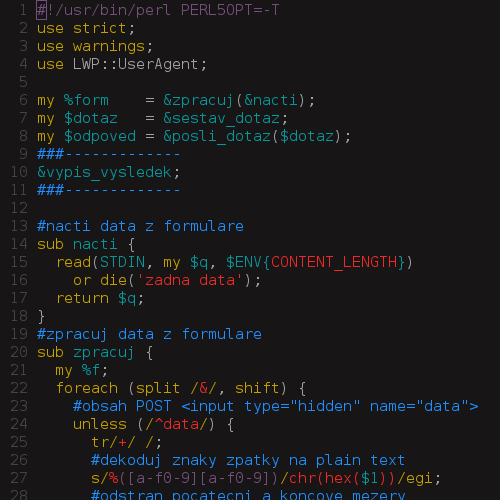
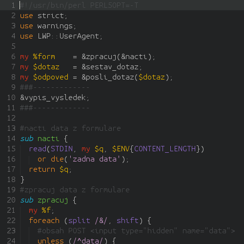

bits #0
=======

## Dropbox as a backup

The service is free up to 2GB so given
that my most important things are just
regular txt files I'm more than backed.

First install [Dropbox](https://www.dropbox.com/install?os=lnx),
second make a [Cron file](http://tldp.org/LDP/lame/LAME/linux-admin-made-easy/using-cron.html).

    % su -
    % pushd /etc/cron.daily/
    % cat > bckup
    #!/bin/sh
    cp --archive --update /home/pavel/txt/ /home/pavel/Dropbox
    cp --archive --update /home/pavel/code/ /home/pavel/Dropbox
    Ctrl^D
    % chown pavel:pavel bckup 
    % chmod +x bckup

## Sleep mode from CLI

Yes, [pm-utils](http://www.google.com/search?q=pm+utils) handle that.
    
    % echo "alias asleep='sudo /usr/sbin/pm-suspend'" >> ~/.bashrc
    % source ~/.bashrc
    % asleep

You might need to adjust the [sudoers file](http://help.ubuntu.com/community/Sudoers#Shutting_Down_From_The_Console_Without_A_Password).

## Grub2 boot entry

If you have a dual-boot and installed GNU/Linux first
and Windows second; you have also a problem. Not only
you have to swap the boot flag (via [fdisk](http://www.debian.org/releases/slink/sparc/fdisk.txt)
[*command* **a**]) between your partitions
but [Grub2](http://www.gnu.org/software/grub/) has
no clue about your Windows there.

You should create the entry by opening `/etc/grub.d/40_custom`
and write something like

    menuentry 'windows7' {
    set root='hd0,msdos3'
    chainloader +1
    }

then

    % pushd /boot/grub2/
    % cp grub.cfg grub.cfg.bak
    % grub2-mkconfig -o grub.cfg

Have a look at the `/etc/grub.d/30_os-prober` file
particularly those `--class windows` lines.

## Vim setup

The following forces [Vim](http://www.vim.org/)
to translate tabs and use indentation with
just 2 spaces:

    % cat >> ~/.vimrc
    set number
    set shiftwidth=2
    set softtabstop=2
    set expandtab
    set t_Co=256
    set autoindent
    filetype indent on
    syntax on
    colorscheme peachpuff
    highlight LineNr ctermfg=238
    Ctrl^D

(gnome-terminal)

Checkout [vi-improved](http://vi-improved.org/)
or [vim-perl](http://github.com/vim-perl/vim-perl)
for more.

## Sublime setup

First get [Sublime](http://www.sublimetext.com/3),
second get [package manager](http://sublime.wbond.net/installation). 

Then via the package manager install [SublimeLinter3](http://github.com/SublimeLinter/SublimeLinter3)
and [SublimeCodeIntel](http://github.com/SublimeCodeIntel/SublimeCodeIntel).
If doing [Perl](http://www.perl.org) you may try [SublimeLinter-perl](http://github.com/oschwald/SublimeLinter-perl).

Additionaly get a nice [theme](http://colorsublime.com/)
or a [font](http://font.ubuntu.com/).

Finally do something like:

    % pushd ~/.config/sublime-text-3/Packages/User/
    % cp Preferences.sublime-settings Preferences.sublime-settings.bak
    % cat > Preferences.sublime-settings
    {
    "auto_complete": false,
    "bold_folder_labels": true,
    "caret_style": "phase",
    "close_windows_when_empty": false,
    "color_scheme": "Packages/Colorsublime-Themes/Darkside.tmTheme",
    "find_selected_text": true,
    "fold_buttons": false,
    "font_face": "Ubuntu Mono",
    "font_size": 13.0,
    "highlight_line": true,
    "line_padding_bottom": 2,
    "line_padding_top": 2,
    "tab_size": 2,
    "theme": "Centurion Blue.sublime-theme",
    "translate_tabs_to_spaces": true,
    "trim_trailing_white_space_on_save": true,
    "word_wrap": "true"
    }
    Ctrl^D

And in a theme file `$HOME/.config/sublime-text-3/Packages/Colorsublime-Themes/Darkside.tmTheme`
you may colorize variables by locating the `Variable`
section and having it like:

    <string>Variable</string>
    <key>scope</key>
    <string>variable</string>
    <key>settings</key>
    <dict>
       <key>fontStyle</key>
       <string></string>
       <key>foreground</key>
       <string>#eab700</string>
    </dict>

(pj)

