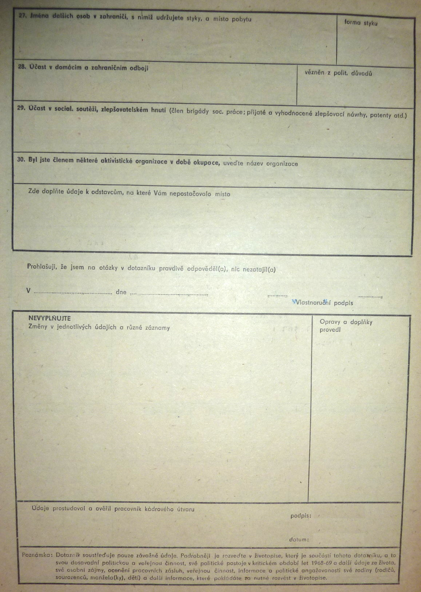

Komu?ismus
==========

> Komunismus — ze své vlastní volby — je největším žijícím
> nepřítelem svobody. V zápase proti sobě stojí systém
> demokratický a komunistický, ne kapitalistický a socialistický.
> *Peroutka, F.: Jací jsme; Demokratický manifest. Středočeské nakl. a knih., Praha 1991, s. 141.*

Začněme s dotazníkem do zaměstnání (ŠKODA PRAHA)
ještě z roku 1986:

6. Třídní - sociální původ
7. Politická příslušnost
  * do r. 1945
  * do r. 1948
  * po r. 1948
  * nyní
10. Majetkové poměry (domek, byt)
17. Stranické funkce
22. Manžel
21. Děti
22. Rodiče
23. Rodiče manžela(ky)
24. Sourozenci vlastní
25. Příbuzní v zahraničí
26. Pobyt v zahraničí
27. Jména dalších osob v zahraničí, s nimiž udržujete styky
28. Účast v domácím a zahraničním odboji

*Údaje prostudoval a ověřil pracovník kádrového útvaru.*

__Poznámka__: Dotazník soustřeďuje pouze závažné údaje.
Podrobněji je rozveďte v životopise, který je součástí
tohoto dotazníku, a to svou dosavadní politickou a veřejnou
činnost, své politické postoje v __kritickém období let 1968-69__
a další údaje ze života [..] informace o politické angažovanosti
své rodiny apod.

I dnes bychom našli [740 tisíc](http://volby.cz/pls/ps2013/ps2?xjazyk=CZ)
natěšených respondentů. Ráj mluví sám za sebe.
Nemá zapotřebí
honit si triko elektřinou v hraničních
plotech nebo zákonem č. [231/1948 Sb.](http://www.ustrcr.cz/data/pdf/projekty/usmrceni-hranice/dokumenty/zakon231-232-1948.pdf).
[Rudé právo](http://archiv.ucl.cas.cz/?path=RudePravo)
dělo *Republiku si rozvrátit nedáme!*
Do res publicae měl aparát patolízalů daleko.
Z ráje se neutíká. A jestli ten ráj neuznáš,
jsi další [spojka na Vatikán](https://cs.wikipedia.org/wiki/Karel_%C4%8C%C3%AD%C5%BEek)
..ohrožující naše socialistické zřízení.

> Velmi jsme si vážili Kim Čong-ila,
> jenž se obětoval, aby přinesl blaho
> korejskému lidu, zajistil bezpečnost
> KLDR a dosáhl mírového sjednocení
> Koreje. KSČM pevně věří, že Korejská
> strana práce překoná nynější smutek
> a nadále povede hrdinný boj korejského
> lidu za obranu socialismu ve Vaší
> krásné zemi.
> *Vojtěch Filip, kondolence KLDR, 2011. In: Havlíková, L. K.: Republika vězňů, vězni republiky. In: Steigerwald, K.: Má vzdálená vlast. Národní divadlo, Praha 2012, s. 17.*

Pár chytrých hlav z NDR se ptá, kde byla chyba:
V tom, že [policista musí poslouchat rozkazy v každé době](http://www.parlamentnilisty.cz/profily/Petr-Duchek-48359/clanek/-Mlaticka-do-politiky-nepatri-34926)?
Jistě, oni mi to poradili, já jen mlátil.
Nebo je na vině čl. 2 odst. 3 [Ústavy](http://www.psp.cz/docs/laws/constitution.html),
kdy úřad nesmí činit nic nad (nebo pod) literu zákona?
Té [dřívější](http://www.psp.cz/docs/texts/constitution_1960.html)
ale podobné znění chybí *(sic!)*.
Navzdory tomu víme, kde se tupost bere:
pohraniční stráž střílela
a prokurátor nasazoval
oprátky dle **tehdy platných** zákonů.
Odvolávat se na *psanost!* pravidla
je hrozivé slabošství. Na něm právě
stojí totalitní i trudné
*demo*kratické režimy. Kánon ožívá
až v rukách a křiku někoho.
Zákon, rozkaz nebo dekret ještě
*nikdy nikoho* nevraždil.
Člověk člověka ale už ano.

> Propaganda vyzývá občana, aby nenáviděl to,
> o čem čte, ne to, co zažil.
> *Peroutka, F.: Jací jsme; Demokratický manifest. Středočeské nakl. a knih., Praha 1991, s. 163.*

Komunismus je z těch dob, ve kterých
"čím hůře, tím lépe". Někomu to
vyhovuje, jinak by to stejně neuměl.
A pak mějme většinu, která se přejícně
rozhodla pro rovnější zítřky. U Edvarda Beneše to byl fanatický strach
z německého *Drang nach Osten* i opakování Mnichova.
A spásu viděl zcela nekriticky v Sovětském svazu.
Jím iniciované četné dohody o spolupráci, vzájemném
přátelství i přehnaná servilita byly jedním
z těch závaží na hloupé straně úvah.

> Říkám jen pro naše lidi, ke kterým v našich věcech
> mám právo mluvit, že vůdcové Sovětského svazu, že Stalin
> sám je politik a státník velikého stylu, velikého vzdělání,
> železné energie a dalekozrakého politického obzoru, že Stalin
> a Molotov jsou zejména velcí sovětští patrioti a že si tudíž
> dovedou cenit patriotismu druhých, jsouce přitom pronikavými
> politickými realisty, kteří vědí co chtějí a co mohou.
> *Beneš, E.: Šest let exilu a druhé světové války. Orbis, Praha 1947 (6. vydání), s. 372.*

Žel bohu, kdyby lidé komunismus skutečně
nechtěli — nebyl by tady. Třeba jsme národem
"kosmologů", který než by čekal na Sputnik,
raději sám začne obíhat jako sovětský satelit.
Nadšení proletářského davu bylo hutnější
než obočí Břežněva. Okolnosti (a utábořené rudé jednotky)
zapůsobily: bylo po válce a i dívky chtěli
být bratry. Pár let zpátky psal Masaryk
*O bolševictví* nebo Čapek *Proč nejsem komunistou*
— nestačilo to, museli jsme si sáhnout.
A zase to nestačí, protože nedlouho
odtud si je budeme chtít i pohladit.
S každým rokem je sentiment hlubší,
fakta smířlivější.

> Ale až jednou vybledne čerstvý dojem z bolševických
> zločinů, bude socialistický program znovu přitažlivý
> pro masy.
> *Mises, von L.: Liberalismus. Ekopress, Praha 1998, s. 24.*

Mantra z éry Listopadu *Nejsme jako oni!*
nedopadla, levota (odleva) zůstala.
I po 26 letech jsou úderníci stále s námi.
A každé 4 roky jim
předáme pár lavic Parlamentu ČR a něco málo
milionů, aby měli co na sebe.
Nebo je zpravíme [radními](http://ceskapozice.lidovky.cz/jihoceska-radni-za-kscm-se-brani-chci-jen-kvalitni-skoly-pib-/tema.aspx?c=A121121_002554_pozice_84596)
pro [školství](http://prehravac.rozhlas.cz/audio/2781412).
Jen paměti národa to nejde do hlavy. Paměti obyvatelů však ano.

> Sláva, socialismus zvítězil,
> člověk už si nemůže koupit, co potřebuje.
> *Peroutka, F.: Jací jsme; Demokratický manifest. Středočeské nakl. a knih., Praha 1991, s. 193.*

Socialismus, slovo křtěné drtí panelu
(více V. Havel ve [Slově o slovu](http://vaclavhavel.cz/showtrans.php?cat=clanky&val=78_clanky.html&typ=HTML)).
Kdo chce jistoty, může popojít.
Na Východ.
Republika lítostí nezajde.

> Neurotik se chytá své životní lži a pokud je postaven před volbu,
> zda se má zříci této lži, anebo logického myšlení, dává přednost
> obětování logiky. Neboť život by byl pro něho nesnesitelný bez útěchy,
> kterou nachází v socialistické ideji. Ta mu ukazuje, že chyby,
> jež zavinily jeho neúspěch, netkví v jeho osobě, ale v chodu světa.
> *Mises, von L.: Liberalismus. Ekopress, Praha 1998, s. 24.*

Bohužel, 40 let života jako pomýlený nevykáží.
Nemohou. Zůstalo by jim už jenom stáří.
Leč neupírejme budovatelům (ani těm po třech lobotomiích)
právo na socialistické (ať už to znamená cokoli)
cítění. Nechme jim i závistivou myšlenku kolektivizmu,
ale už *nikdy* nedovolme způsob,
kterým ho má nebo mělo být
dosaženo.

> Komunismus je názor,
> že vypálením Louvru se všichni naučí malovat.
> *Zbyněk Dráb, [zbyhnev.com](https://www.facebook.com/zbyhnevdotcom/posts/696642100447455)*

Nikdo nedovede mít
*raději* bližního než sebe.

> To se nemá chápat tak, že člověk má milovat
> bližního stejně jako sám sebe, ale podobně
> jako sebe [..]
> *Akvinský, T.: O lásce. KRYSTAL OP, Praha 2005, s. 216.*

A obdobně:

> Ne tak má rozuměno být, když by někdo činil
> hmotnou almužnu jednomu bližnímu, že by každému
> na celém světě mohl totéž učinit, ale jako kdyby
> nemocnou ruku léčil, to by prospívalo celému
> tělu i všem údům toho těla.
> *Chelčický, P.: Ze sítě víry. Československý spisovatel, Praha 1990, s. 136.*

Demokracie umí být lidská
i méně lidská. Komunismus nic neumí:
je vždy bezpříkladně nelidský.
Hrstky oddaných [juniorů](http://www.juniorproject.eu/)
to ale [nechtějí](http://prehravac.rozhlas.cz/audio/3061945)
chápat; a otrlejší *Vojtové* [glosují](http://www.novinky.cz/domaci/352873-politici-padaji-do-sprostoty-po-zemanovi-se-predvedl-filip.html).
Vzato nemusí dlouho trvat, abychom *jednotně k práci,
jednotně k volbám* vyráželi ex novo
— chtivost a lysé hlavy to nikdy
a nikam nemají daleko.
Přirazí rychle.
Na stranu druhou:

> [..] komunismus sám pobil daleko více komunistů,
> než stačili všichni ostatní dohromady.
> *Peroutka, F.: Jací jsme; Demokratický manifest. Středočeské nakl. a knih., Praha 1991, s. 142.*

Ale spolehnout se na to nemůžeme.
Nic by neřešila změna názvu strany
ni exkomunikace těch nejubožejších z jejich
řad — tady běží o naprostou vymletost
*celého* jejich skupenství.

> [..] někdy více lidí umíralo na politiku než na nemoci.
> *Peroutka, F.: Jací jsme; Demokratický manifest. Středočeské nakl. a knih., Praha 1991, s. 202.*

Záliba v komunismu měla a má být trestná. Není.
Asi tak mnozí dávají vyniknout své velikosti
a dobrotě. Nepochopili ale jedno:

> Zač pokání při zpovědi přijali, to
> i s pokáním bez přestání dělají [..]
> neodpouští Bůh pražádnému hříchy, jedině
> jestliže odstoupí od nich vůlí, úmyslem
> i skutkem.
> *Chelčický, P.: Ze sítě víry. Československý spisovatel, Praha 1990, s. 74.*

Ta domýšlivost ponechala knížky tmeličů
klidnému stáří a ideologii v pozadí
ještě klidnější dospělosti.

> Madness is rare in individuals  
> – but in groups, parties, nations,  
> and ages it is the rule.
> *Friedrich Nietzsche*

Standarta srpu a kladiva halí [více obětí](https://en.wikipedia.org/wiki/Mass_killings_under_Communist_regimes)
než svastika hákového kříže. Třeba proto,
že jsme hvězdu "míru" nechali nad Evropou
(a světem) *zářit* desítky let. ÚSTR zkoumá
komunismus jako totalitní režim, Ministersto
obrany odškodňuje 3. odboj a přesto není
bolševická idea zákonem odmítnutá (na rozdíl
od věci nácismu).

> Komunisté, kteří nejdříve chtějí revoluci a pak teprve
> všechno ostatní, nemají ze svého stanoviska tak docela pravdu,
> nepřejí-li si zlepšení hospodářských poměrů a doufají-li v těžké
> krize a bídu mas, neboť maso na talíři je sice přátelské lidu,
> avšak nepřátelské revoluci. Čím hůře, tím lépe — taková je
> komunistická strategická moudrost.
> *Peroutka, F.: Jací jsme; Demokratický manifest. Středočeské nakl. a knih., Praha 1991, s. 115.*

Zákazy. Pravda, nejsme jako oni, ale stát
stojí proto, že je právo. Vice versa není nic.
Řád jednotlivce je svobodou jednotlivců.
Z preambule Ústavy:
*[..] jsou si vědomi svých povinností vůči druhým a zodpovědnosti vůči celku.*
A to se komunismu příčí:

> Nic horšího nemůže komunista spáchat
> než udělat něco v zájmu státu československého.
> To se musí našim komunistům nechat, že pro
> tenhle zájem mají tuze málo smyslu. Ještě
> se jim nestala ta hanba, že by se něčeho
> dopustili v zájmu státu československého;
> že by mu byli nějak ke cti, že by přinesli
> něco, co by vůbec mělo co dělat s touto zemí,
> že by vůbec teď či příště byli k něčemu
> kloudnému pro to prostředí, ve kterém žijí.  
> __Lidové noviny, 19. 10. 1928__  
> *Čapek, K.: O umění a kultuře; Od člověka k člověku. Český spisovatel, Praha 1995, s. 208.*

Zpovídat šíření (stavění na odiv) tužeb
komunismu, nikoliv osvětu nebo soukromé
(třeba polohlasné) "zvážení". Nechť je
o něm dostupných maximum informací,
nechť se o něm z gusta debatuje a třeba
i polemizuje, jen ať už ho proboha
nikdo nepouští ke slovu (ani ke stolu).
Komunismus
jednou celé století dostal —
další nepotřebuje. A my netaktně
(a netakticky) mlčíme.

> [..] hlásí se [Steigerwald] k ideálu
> a riskuje, že bude "lecjakými Vojty",
> ale i frikulíny, kteří předstírají,
> že jsou "cool", "free" a "in",
> napadnut z idealismu, z heroizace
> a patetizace, z toho, že některé
> hodnoty prostě bere příliš vážně...
> A on skutečně bere své hrdinky
> vážně, on si jich opravdu nelíčeně
> váží.
> *Vedral, J.: Dobové tance na nápěv budovatelského kýče. In: Steigerwald, K.: Má vzdálená vlast. Národní divadlo, Praha 2012, s. 45.*

Je vpravdě snazší se dnes nakrásně
vymezit vůči všem, kteří podlehli.
Já tu možnost nedostal, asi jsem
tak z obliga. Nahlížet věci lze
však právě proto, že jich nejste
součástí. Třeba platí, že chybu
musíme nejprve udělat,
abychom věděli, že to chyba je.
Nikdo ale nedělá chyby 40 let.

> Jedna z vyslýchaných ohluchla, když
> ji referent udeřil. A kdo jsou tihle
> "referenti", "vychovatelé", "dozorci"?
> Mnozí z nich pokračovali ve své práci
> a kariéře i po převratu v roce 1989,
> stejně jako řada soudců a státních
> zástupců.
> *Havlíková, L. K.: Republika vězňů, vězni republiky. In: Steigerwald, K.: Má vzdálená vlast. Národní divadlo, Praha 2012, s. 23.*

Marx mohl mít něco na srdci
ve svém 19. století, kdy jím zmíněná
nadhodnota byla [unfair](https://youtu.be/MxldKIiZ3EA?t=40s)
a pracovní zákoník raději nebyl vůbec.
Řešit to hodlal vypovězením práva Mít.
Ano, strašně šlechetné, ale společenství
lidí není pytlem buráků.
Doby průmyslové revoluce jsou teď pryč,
a kdo je chce vzpomenout,
přečte si [Zolu](http://search.mlp.cz/cz/titul/zabijak/2837868/)
a ne Marxe.

> Spravedlnost je slepá; u nás bohudík ne,
> nýbrž jen šilhá (nalevo).
> *Čapek, K.: O umění a kultuře; Od člověka k člověku. Český spisovatel, Praha 1995, s. 91.*

Komunismus je sám o sobě tak absurdní,
že vůbec argumentovat je [non-sense](https://youtu.be/djFcjDyaZNY).
Víc než korektním vyzněním z Opilých banánů:
*Komunismus je svinstvo a bolševici jsou svině.*
A *Si vis pacem, para bellum* zeje do tmy.

> Historie učí, že ničeho není dosaženo jednou provždy.
> *Peroutka, F.: Jací jsme; Demokratický manifest. Středočeské nakl. a knih., Praha 1991, s. 139.*

Demokracie má třeba trny: *Právem se stává to,
co většina za právo prohlásí [Aristotelés]*.
V proletariátu člověk halekat nemohl,
dnes mluvit může, ale
nikdo ho neslyší (jak se jednou vyjádřil
Jaroslav Hutka). Stejně jako může většina
většinou pravdu míjet, zatímco menšina končí
proformou, kreditem, oporou,
ospravedlněním svědomí většiny:
Podívejte, máme demokracii!
V komunismu ale menšina není žádná.
Spektrum mezi černou a bílou je pryč.
Vyhnívá v něm šedý monolit.

> Demokracie? Ano — ale ne proboha v řečnění. V práci.
> V srdci. V každém dechu, v konání a myšlení. Tam demokracie.
> *Baťa, J.A.: Za obchodem kolem světa. Tisk, Zlín 1937, s. 230.*

Kdo nechce, ten nebude vědět.
A přesně takoví rozhodují (i vyhrávají) volby.

> Svoboda je hodnota, jejíž přítomnost přínáší
> méně potěšení než její nepřítomnost bolesti.
> *Jean Paul*

Radí tak Kostohryz Demkovi:  
*Věř svým očím, ale uším moc nevěř [Solženicyn]*.

(pj)

* __zdroje__
* [Komunistický manifest](https://www.gutenberg.org/files/31193/31193-h/31193-h.htm)
* Šaroch, Z.: Výstřely z hranice
* [Husák](http://youtu.be/CvbMM0fyV5U?t=7m9s), [Štěpán](https://youtu.be/c89MIWlqSNw), uvědomělý [poslanec](http://www.psp.cz/sqw/detail.sqw?id=6224) [Ondráček](http://youtu.be/W21maRT1sm0)
* [Mé dětství v socialismu](http://www.detstvivsocialismu.cz/)
* [Komunistický převrat v ČSR](http://www.pametnaroda.cz/anniversary/detail/id/6)
* Drda, A., Dudek, P.: Kdo ve stínu čeká na moc
* Drda, A.: [Proč nejsem Rusku vděčný za osvobození](http://hlidacipes.org/adam-drda-proc-nejsem-rusku-vdecny-za-osvobozeni/)
* [Někteří komunisté to mysleli dobře](http://prehravac.rozhlas.cz/audio/2356363)
* [Proč nás stěhujete](http://prehravac.rozhlas.cz/audio/3059233)
* [Václav Vaško](http://prehravac.rozhlas.cz/audio/3159834)
* [Mons. ThDr. Oto Mádr](http://www.pametnaroda.cz/story/madr-oto-1917-106)
* Hvížďala, K., Havel, V.: Dálkový výslech
* Havel, V.: Do různých stran
* Rašín, A.: Mé vzpomínky z mládí
* Palacký, F.: Myšlenky Františka Palackého
* Kryl, K.: Země Lhostejnost
* Baťa, J.A.: Za obchodem kolem světa
* Tigrid, P.: Kapesní průvodce inteligentní ženy po vlastním osudu

__Peroutka__
> Demokracie musí pečovat o to, aby byla většinou.
> *Peroutka, F.: Jací jsme; Demokratický manifest. Středočeské nakl. a knih., Praha 1991, s. 209.*

#

> Demokracie do sebe přijímá tezi a antitezi
> a dává jim ochranu práva a zákona.
> *Ibid., s. 140.*

#

> Dvě tendence proplétají se historií, protikladné,
> ale obě nepopiratelné, tendence ke svobodě
> a tendence k disciplíně.
> *Ibid., s. 224.*

#

> Přestala existovat porážka, existuje jen zničení.
> *Ibid., s. 133.*

